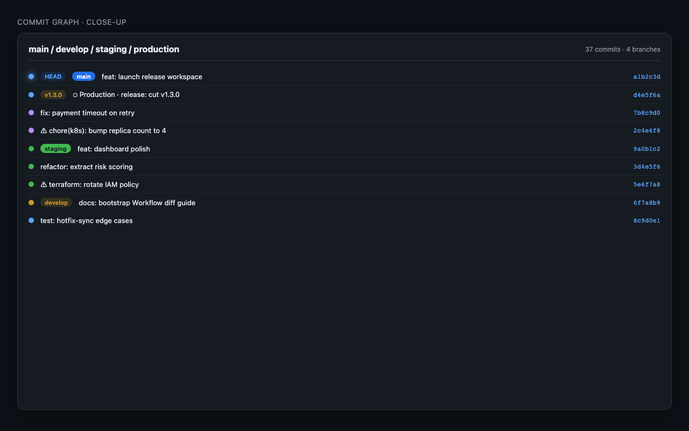
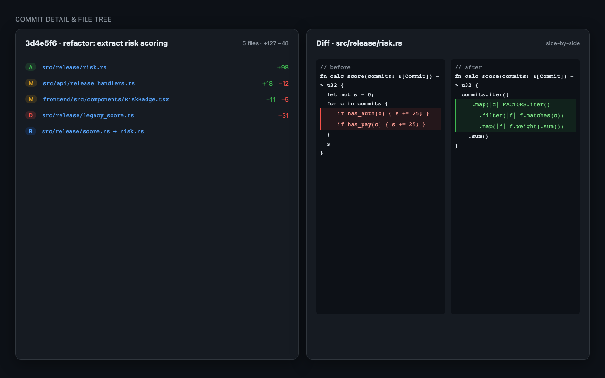
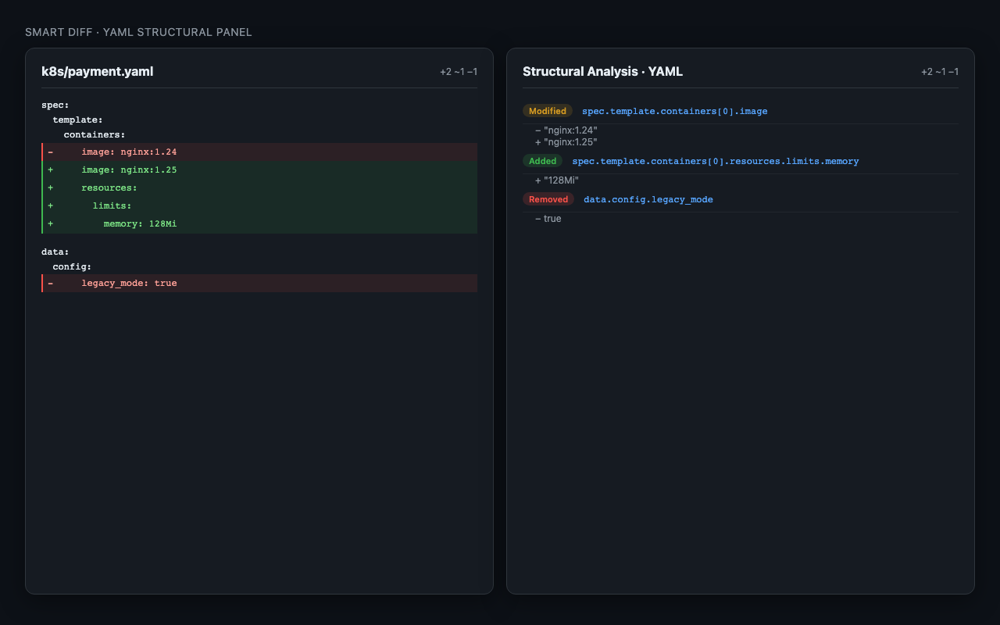
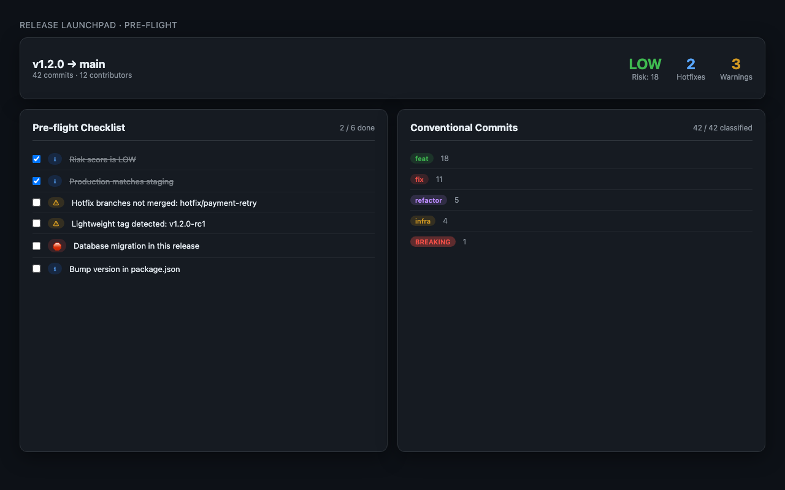
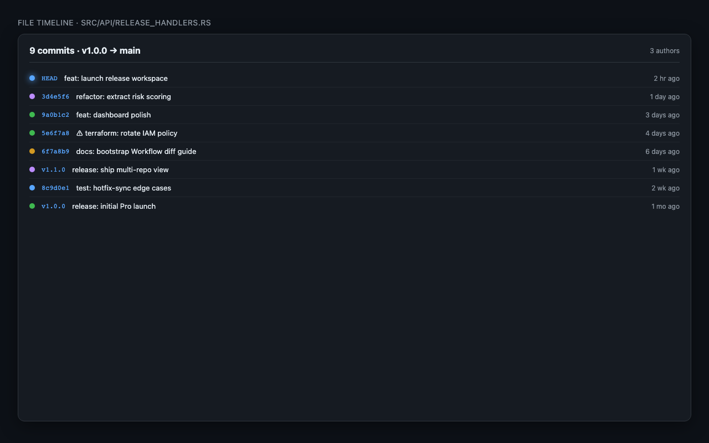

<div align="center">


# GitFlowGraph

**The Git visualization workspace built for Zed**

Understand your entire codebase history — commits, branches, diffs, and releases — without leaving your editor.

[](https://zed.dev/extensions?q=gitflowgraph)
[](https://github.com/DevEloLin/GitFlowGraph/releases)
[](LICENSE)
[](https://github.com/DevEloLin/GitFlowGraph/releases)

<br/>


<sub>Git commit graph with color-coded lane visualization, branch labels, and inline diff panel</sub>

<br/>

</div>

---

## What is GitFlowGraph?

GitFlowGraph is a [Zed](https://zed.dev) extension that brings a complete Git visualization workspace into your editor. It replaces context-switching between your terminal, a browser-based Git UI, and your IDE — giving you one panel to explore history, understand changes, and manage releases.

The extension wrapper in this repository is **open source (MIT)**. The runtime engine that powers the Git graph, Smart Diff, and Release Flow is a precompiled binary distributed separately.

---

## Features at a Glance

| | Feature | Free | Pro |
|---|---------|:----:|:---:|
| 📊 | Git commit graph | ✓ | ✓ |
| 📋 | Commit table view | — | ✓ |
| 🔍 | Commit detail & unified diff | ✓ | ✓ |
| ↔️ | Side-by-side split diff | — | ✓ |
| 🏷️ | Branch & tag labels | ✓ | ✓ |
| 🔎 | Search, regex & multi-filter | ✓ | ✓ |
| ⚡ | Uncommitted changes row | — | ✓ |
| 🖱️ | Context menu Git actions | ✓ | ✓ |
| 📈 | Commit limit | 500 | 5 000 |
| 🧠 | **Smart Diff** (YAML / JSON / Terraform) | — | ✓ |
| 🚀 | **Release Flow** | — | ✓ |
| 🌐 | **Cross-Repo Timeline** | — | ✓ |
| 🗂️ | Multi-repo workspace | — | ✓ |

---

## Git Graph



Visualize your entire commit history as an interactive graph with color-coded branch lanes.

- **Lane rendering** — each branch gets a distinct color; merge commits show convergence lines
- **Branch & tag badges** — pill labels inline on every relevant commit
- **HEAD indicator** — glowing dot and `HEAD` badge marks the current checkout
- **Real-time filtering** — filter by keyword, regex, author, branch, date range, or file path simultaneously
- **Click to inspect** — select any commit to open the diff detail panel on the right

---

## Commit Table


A spreadsheet-style layout with the lane graph rendered as an inline SVG column — giving you the best of both list and graph views.

- **Uncommitted changes row** — always pinned at the top when your working tree is dirty, with file count
- **All the same filters** — the same search, author, date, and branch filters apply
- **Right-click context menu** — checkout, create branch, create tag, cherry-pick, soft/hard reset
- **Keyboard shortcut** — `⌘R` to refresh everything

---

## Commit Detail & Diff Viewer



Click any commit to open a full diff panel without navigating away.

- **File tree** — collapsible directory tree of every changed file with `A` `M` `D` `R` status badges
- **Unified diff** — classic `+` / `−` line diff with token-level coloring
- **Side-by-side diff** *(Pro)* — split pane for easier before/after comparison
- **Stats bar** — total files changed, lines added `+`, lines removed `−`
- **Binary file detection** — graceful `Binary file — no preview` message instead of garbled output
- **Parent links** — clickable short SHAs for merge commits

---

## Smart Diff *(Pro)*



Semantic, structure-aware diffing for configuration and infrastructure files. Instead of raw text, Smart Diff understands the document shape and reports what logically changed.

### Supported formats

**YAML**
```
~ spec.template.containers[0].image
    nginx:1.24  →  nginx:1.25
+ spec.template.containers[0].resources.limits.memory
    128Mi
```

**JSON**
```
~ data.config.timeout
    30  →  60
- data.config.legacy_mode
```

**Terraform / HCL**
```
~ resource.aws_instance.web.instance_type
    t3.micro  →  t3.small
+ resource.aws_security_group.web.ingress[1]
```

Every change carries its full structural path so you always know exactly what changed — not just that line 47 is different.

---

## Release Flow *(Pro)*



Compare any two refs to see exactly what is in-flight between your environments.

- **Ref picker** — any combination of branches, tags, or commit SHAs
- **Commit list** — all commits between the refs, sorted chronologically
- **Changelog generator** — one-click Markdown changelog grouped by conventional commit type (`feat`, `fix`, `chore`, `docs`, …)
- **Hotfix tracker** — highlights cherry-picked commits that diverged from the main release line

---

## Cross-Repo Timeline *(Pro)*



One unified chronological view of activity across all your repositories.

- Add up to **5 repositories** to your workspace
- All commits merged into a single scrollable timeline
- Author and keyword search apply across all repos simultaneously
- `⌘1` / `⌘2` / `⌘3` keyboard shortcuts to switch the active repo

---

## Installation

### Zed Marketplace *(recommended)*

1. Open Zed
2. Press `⌘⇧X` → **Extensions**
3. Search **GitFlowGraph**
4. Click **Install**

The runtime binary (~15 MB) downloads automatically on first use.

### Manual / Dev Mode

```bash
git clone https://github.com/DevEloLin/GitFlowGraph
cd gitflowgraph
zed --install-extension .
```

---

## Usage

### Launch the panel

Type in the Zed AI assistant:

```
/gitflowgraph
```

Then open **http://localhost:9876** in your browser.

### Smart Diff a commit range

```
/gitflowgraph-diff HEAD~5..HEAD
```

### Keyboard shortcuts

| Shortcut | Action |
|----------|--------|
| `⌘R` | Refresh commits, branches, tags |
| `Esc` | Close commit detail panel |
| `⌘1` `⌘2` `⌘3` | Switch active repository *(Pro)* |

### Activate Pro / Start Trial

Open **http://localhost:9876** → navigate to the **License** tab.

- **30-day free trial** — one click, no credit card required
- **Purchase** a license at [gitflowgraph.dev](https://gitflowgraph.dev) and paste the key

---

## Architecture

```
┌──────────────────────────────────────────────────────┐
│  Zed Editor                                          │
│                                                      │
│  ┌─────────────────────────────────────────────┐    │
│  │  gitflowgraph  (this repo, MIT)             │    │
│  │  Zed Extension + LSP stub                   │    │
│  │  • Downloads runtime on first launch        │    │
│  │  • Registers /gitflowgraph slash commands   │    │
│  └───────────────────┬─────────────────────────┘    │
│                      │ spawns                        │
│  ┌───────────────────▼─────────────────────────┐    │
│  │  gitflowgraph-core  (proprietary binary)    │    │
│  │  • Axum HTTP server on :9876                │    │
│  │  • React + Vite frontend (embedded)         │    │
│  │  • Git engine via libgit2                   │    │
│  │  • Smart Diff parser (YAML / JSON / HCL)    │    │
│  │  • License & trial engine                   │    │
│  └─────────────────────────────────────────────┘    │
└──────────────────────────────────────────────────────┘
```

| Component | Repo | License |
|-----------|------|---------|
| Zed extension wrapper | `DevEloLin/GitFlowGraph` *(this repo)* | MIT |
| Core runtime binary | `DevEloLin/GitFlowGraph-core` | Proprietary |

This split keeps the Zed marketplace integration fully auditable while protecting the core algorithms.

---

## Privacy

- **All Git operations run locally** — no commit data, diffs, or file contents ever leave your machine
- **License validation is offline-first** — cryptographic verification with no server round-trip for day-to-day use
- **Zero telemetry** — no analytics, no crash reporting, no usage tracking

---

## Contributing

The extension wrapper (`src/`) is MIT-licensed and contributions are welcome.

```bash
git clone https://github.com/DevEloLin/GitFlowGraph
cd gitflowgraph
cargo build
```

Please open an issue before submitting large changes.

---

## Support

| | Channel |
|---|---------|
| 🐛 | [GitHub Issues](https://github.com/DevEloLin/GitFlowGraph/issues) — bugs & feature requests |
| 💳 | team@gitflowgraph.dev — license & billing |
| 🌐 | [gitflowgraph.dev](https://gitflowgraph.dev) — website & docs |

---

## License

The Zed extension wrapper in this repository is released under the **[MIT License](LICENSE)**.

The `gitflowgraph-core` runtime binary is proprietary software — see [gitflowgraph.dev/terms](https://gitflowgraph.dev/terms) for the end-user license agreement.

---

<div align="center">

Built for the Zed community &nbsp;·&nbsp; [gitflowgraph.dev](https://gitflowgraph.dev)

</div>
